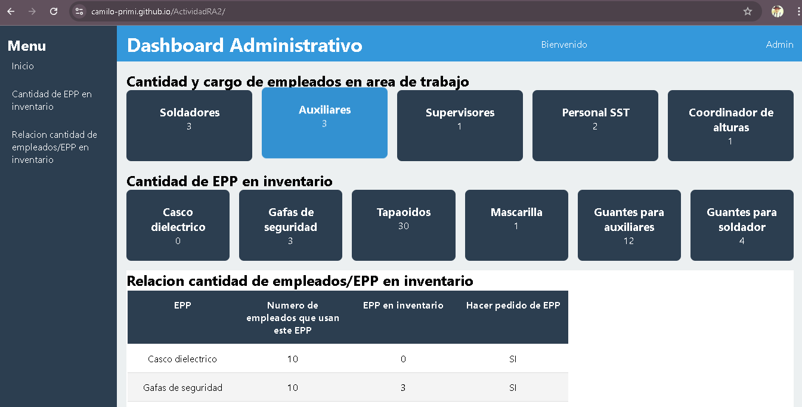
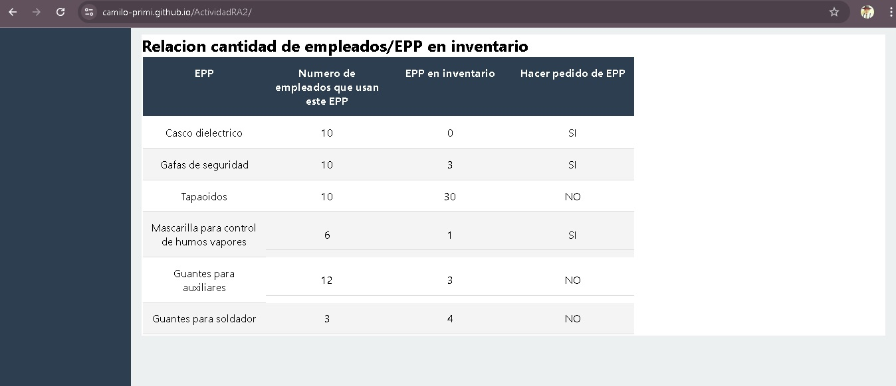
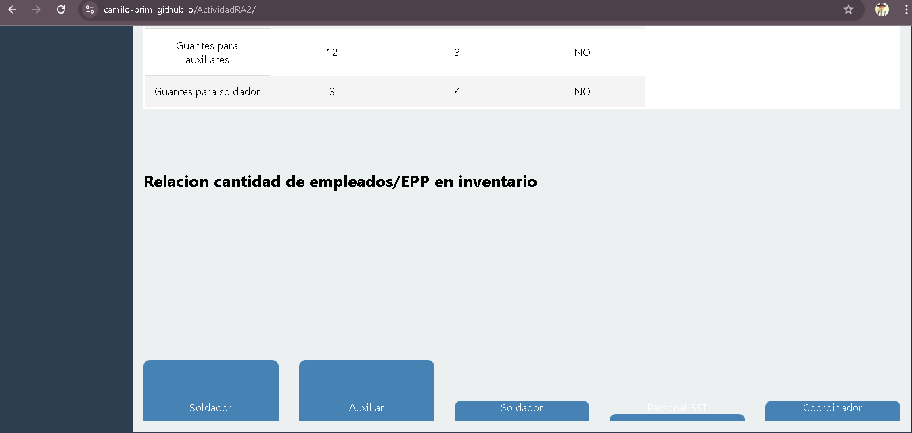
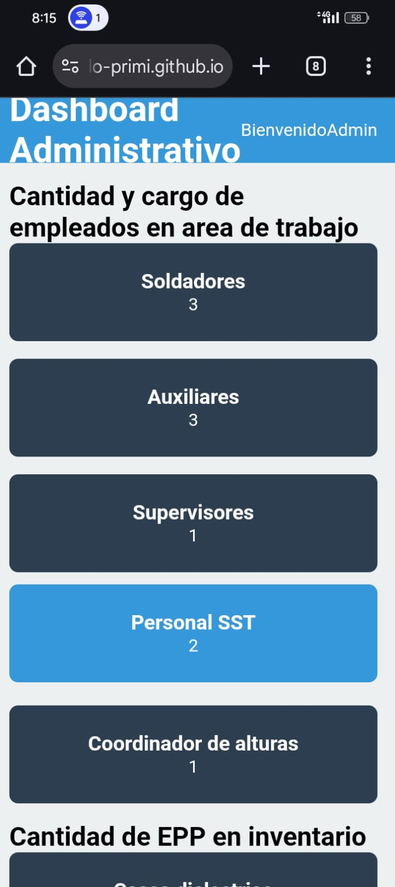
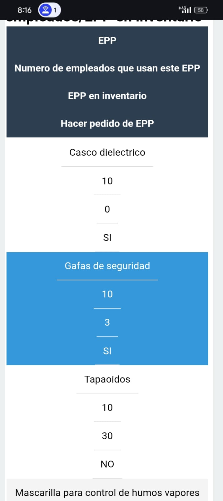
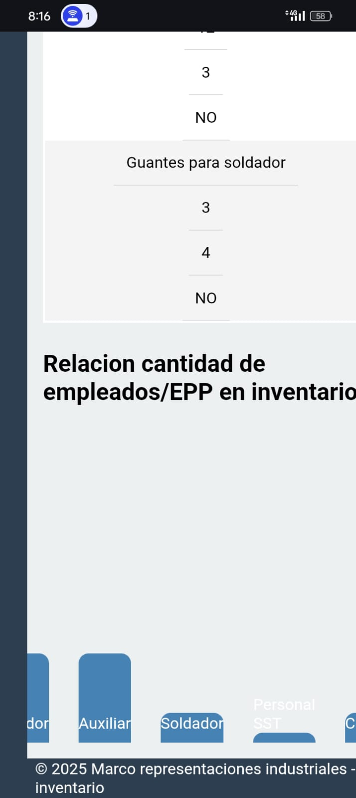
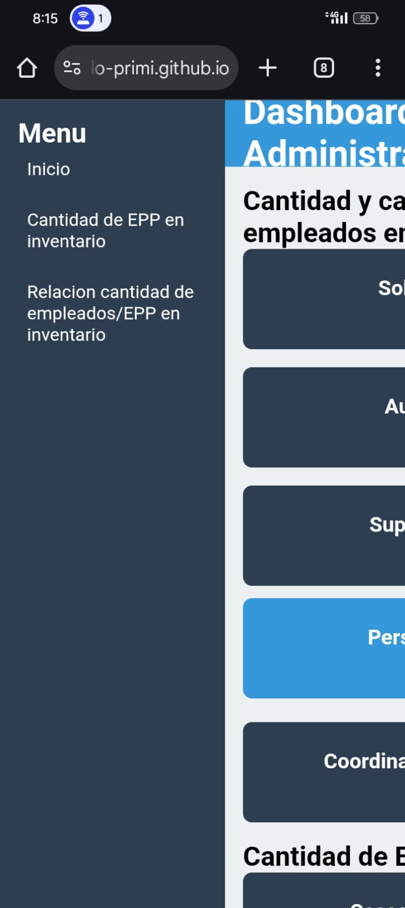
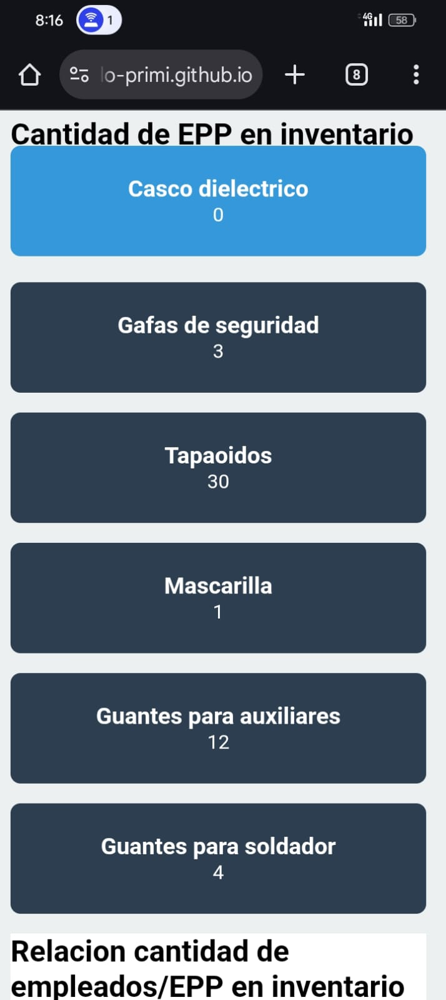

# Proyecto: Actividad 3 - Diseño Web

Este repositorio contiene una página web de práctica donde aplico conceptos de **HTML5** y **CSS3** (flexbox y grid) realizando un dashboard para la empresa Marco representaciones para el manejo de invetario de EPP (Elementos de proteccion personal) donde se relaciona la canidad de empleados con la cantidad de epp en inventario.

## Instalación
1. Clona el repositorio:
   ```bash
   git clone [Actividad RA 2](https://camilo-primi.github.io/ActividadRA2/)

## Tecnologías usadas
- HTML5
- CSS3 (Flexbox, Grid)
- Git y GitHub

## Capturas de pantalla










## 	Breve explicación de las decisiones de diseño y accesibilidad.

Se utilizó una paleta de colores contrastante para mejorar la legibilidad del contenido.

La tipografía elegida es sans-serif por su simplicidad y buena lectura en pantallas.

Se aplicó un diseño responsivo usando Flexbox y Grid, de manera que la página se adapta a diferentes tamaños de pantalla (PC, tablet, móvil).

Se usaron etiquetas semánticas de HTML5 (header, nav, main, section, footer) que ayudan a estructurar el contenido y facilitan la navegación asistida.

Se respetaron niveles de encabezados (h1, h2, h3...) en orden jerárquico para mantener la coherencia del documento.

Los enlaces incluyen un texto descriptivo (no solo "clic aquí") para mejorar la comprensión.

